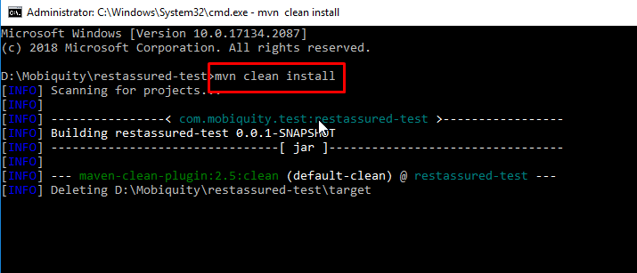
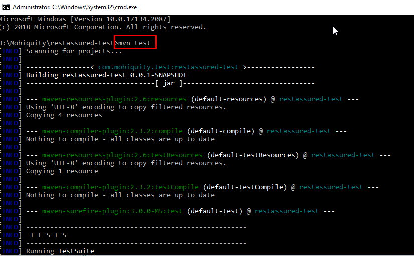
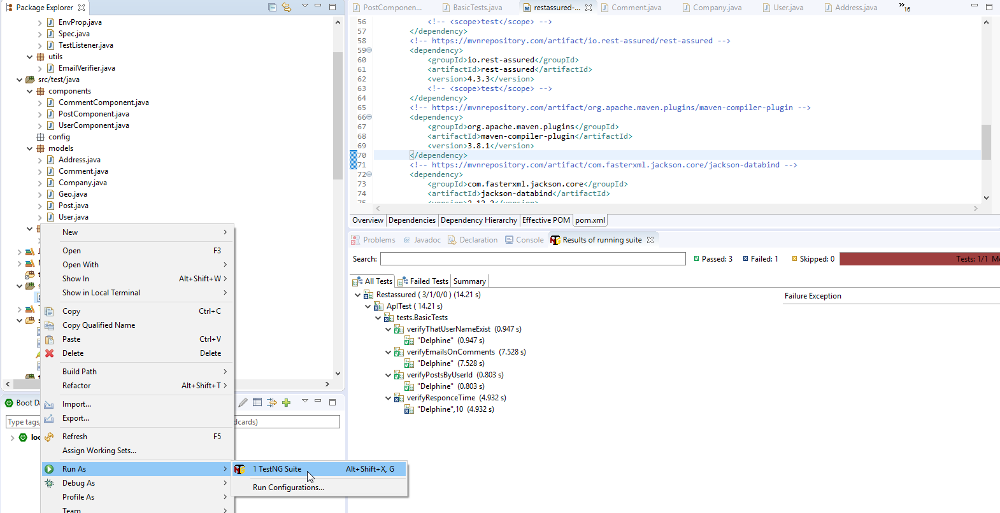
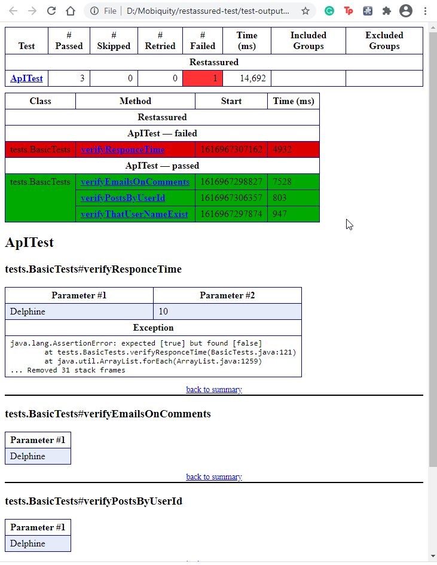

[](https://app.circleci.com/pipelines/github/ozlemgulp/api_test)
# API Test Framework
[](https://maven.apache.org/)
[](https://maven.apache.org/surefire/)
[](https://rest-assured.io/)
[](https://testng.org/doc/)
[](https://jsonplaceholder.typicode.com/)

Testing and validating JsonPlaceholder REST services with RestAssured in Java.<br/>

## Table of contents
* [General info](#general-info)
* [Technologies](#technologies)
* [Prerequisites](#prerequisites)
* [Setup](#setup)
* [TestRun](testrun)
* [TestReport](#testreport)
* [Features](#features)
* [Status](#status)
* [Contact](#contact)

## General info
This is test automation framework skeleton.<br/>
JsonPlaceholder is Free fake API for testing and prototyping.<br/>
RestAssured used for the testing and validation of RESTAPIs.<br/>
TestNG framework used for running and designing tests.<br/>

## Technologies
* Java - version 8.0<br/>
* Maven  - version Apache Maven 3.6.3 [](https://maven.apache.org/surefire/)<br/>
* TestNg<br/>
* RestAssured<br/>
## Prerequisites
* Needs JDK 8+ to be installed. (For more information about installation : https://docs.azul.com/zulu/zuludocs/ZuluUserGuide/Title.htm)
* Needs Maven to be installed. (For more information about installation : https://maven.apache.org/guides/getting-started/maven-in-five-minutes.html)

## Setup
Git clone the repository to your local environment for further information refer to the link: https://docs.github.com/en/github/creating-cloning-and-archiving-repositories/cloning-a-repository
```bash
git clone https://github.com/ozlemgulp/api_test.git
```
To build the artifact go to the project root folder and open cmd and run the command:
```bash
mvn clean install
```

## TestRun
Test can be run with 2 option<br/>
**1. Run tests from  cmd:**<br/>
```bash
mvn test
```



**2. Run test by using testng.xml**<br/>
Import the project to IDE<br/>
find the testng.xml right click to file> Run As >TestNG Suite

## TestReport
Maven surfire report created after each run under test-output folder<br/>


## Features
List of features ready and TODOs for future development
* Awesome feature 1: Search for the user with username “​keyword​”
* Awesome feature 2: Use the details fetched to make a search for the posts written by the 
user.
* Awesome feature 3: For each post, fetch the comments and validate if the emails in the 
comment section are in the proper format.

To-do list:

## Status
Project is:  _finished_

## Contact
Created by [@ogpamuk](https://github.com/ozlemgulp) - feel free to contact me!
